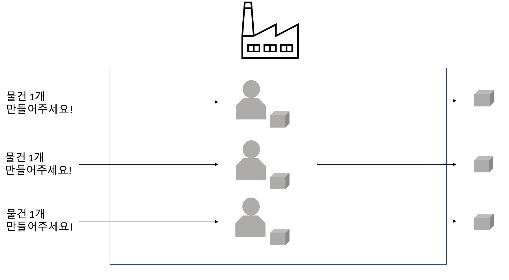

오랜만에 블로그에 글을 쓴다.

그동안 정신없이 이것저것 시도하면서 혼자 공부를 하던 중, 이것만은 글로 기록해 둬야겠다는 생각이 들어서다.

나는 보통 어떤 기술에 대해 궁금한게 생기면, 그 기술을 직접 사용하여 무언가를 구현해보며 익히는 편이다.(일단 부딪히고 보는 타입)

이번에도 Kotlin과 Spring Webflux에 관심이 생겨 직접 부딪혀 보며 개발을 하려는데..

너무 욕심이 과했던 탓일까? 이해하기 힘든 부분들이 많아 이대로는 진행이 안되겠다 싶어, 예외적으로  선 공부후 개발에 착수하기로 마음먹었다.

이 글은 그 기록의 시작점이다.

# Reactive Streams

전통적인(그리고 현재 대부분의) Spring 애플리케이션은 차단식 동기 프로그래밍으로 구현되어 있으며, 그 근본에는 절차지향(명령형) 프로그래밍이 있다.

말그대로 코드 한줄한줄 따라 내려가면서 명령어가 수행되는 구조인것이다.

이러한 절차지향 프로그래밍 기법은 "차단"을 유발하며, 이 차단은 리소스의 낭비를 유발한다.

웹 어플리케이션의 Requests(threads)와 Response를 공장 노동자와 생산되는 물건에 비유해보겠다.

### 노동자와 결과물

어떤 도토리 공장에서는 전화를 통해 도토리의 생산 주문을 실시간으로 받고, 주문을 받는 즉시 공장 노동자는 생산 작업에 착수하며,

생산 작업이 완료되면 도토리를 주문자에게 보낸다. 여러개의 도토리 생산 주문을 받으면 여러명의 노동자가 동시에 생산 작업에 착수한다.

그림으로 보면 다음과 같다.

이를 Spring Web Application에 비유하면, 노동자는 Thread로 볼 수 있고, 도토리는 Response로 볼 수 있다. 아래의 그림과 같이 말이다.

http Request가 오게되면, 서블릿 컨테이너(Tomcat 등)는 Thread Excutor를 통해 각 요청을 Thread로 처리한다. 이 때, 요청마다 정보를 저장하는 공간은 ThreadLocal이라는 객체를 통해 처리한다.

보통의 웹 어플리케이션의 경우 JDBC를 이용하여 데이터베이스에서 정보를 얻어와 요청에 대한 처리를 진행하는 경우가 많다. 이 때 JDBC를 통해 DB에 데이터를 요청하게 되면 Thread는 DB가 데이터를 돌려주기 전까지 아무일도 하지 못하고 기다려야 하는데, 이를 Blocking 상태에 있다고 부른다.